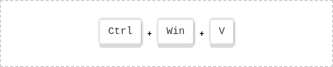
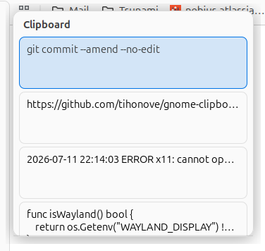
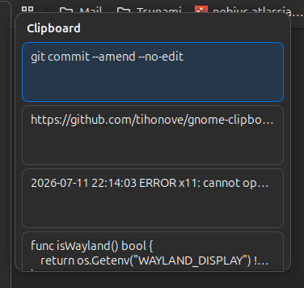
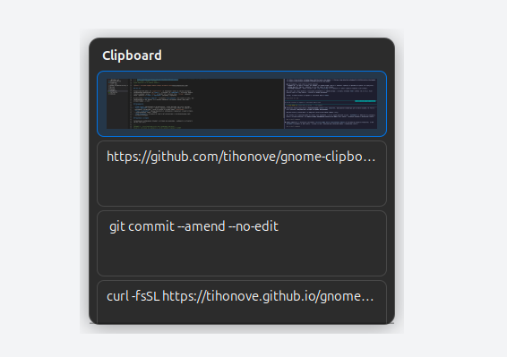

# Clipboard history for GNOME 

Clipboard history for **Ubuntu (GNOME)** — a `Win+V` equivalent. A native GTK daemon
styled after **Yaru** that works on **Wayland and X11**. On `Super+Ctrl+V` it shows a
list of what you copied and pastes the chosen entry into the active window.

<table>
  <tr>
    <td align="center"><br><sub>Light theme</sub></td>
    <td align="center"><br><sub>Dark theme</sub></td>
  </tr>
</table>

## What it is

A resident GTK daemon. On `Super+Ctrl+V` it shows a popup with the most recently
copied items: on **X11** — at the cursor, on **Wayland** — centered on screen. Arrows
pick an entry, `Enter` pastes it into the active window, `Escape` closes the popup.
It keeps both **text and images** (for example, screenshots).

History lives **in memory only** — the last **25 entries**, with no disk, no sync and
no cloud. This is deliberate: the tool does one thing — clipboard history — and
nothing else.

## Features

- **Yaru theme** is picked up automatically — the popup looks like part of the system.
- **X11 and Wayland**: on X11 — the popup at the cursor and paste via XTEST
  (layout-independent); on Wayland — a centered popup and paste via `/dev/uinput`.
- **Text and images**: plain snippets and images (screenshots) in one history, with
  deduplication; newest on top.
- **A single binary**: install from our own apt repository with auto-updates, or as a
  standalone binary.

## Images in history

A copied image lands in history as a thumbnail — you pick and paste it just like text.



## Installation

**Via apt (recommended, with auto-updates):**

```sh
curl -fsSL https://tihonove.github.io/gnome-clipboard-history-native/install.sh | sh
```

**Standalone binary (no apt):**

```sh
curl -fsSL https://tihonove.github.io/gnome-clipboard-history-native/install-standalone.sh | sh
```

Both scripts set everything up themselves (the `Super+Ctrl+V` hotkey, autostart, and
on Wayland — access to `/dev/uinput`) and start the daemon in the current session —
nothing to finish by hand, `Super+Ctrl+V` works right away.

Only if you downloaded the bare binary from
[Releases](https://github.com/tihonove/gnome-clipboard-history-native/releases) by hand,
run the one-time setup yourself:

```sh
gnome-clipboard-history-native --install
```

## Usage

- `Super+Ctrl+V` — open the history popup.
- Arrows, `PageUp` / `PageDown`, `Home` / `End` — navigate the list.
- `Enter` — paste the selected entry into the active window.
- `Escape` — close the popup.

## Configuration

Settings live in `~/.config/gnome-clipboard-history-native/config.{json,yaml,toml}`
(the format is picked by extension). `--install` drops a ready `config.yaml` with
comments — just edit it.

For now there's a single field — `hotkey`, the shortcut in GNOME accelerator syntax
(default `<Super><Control>v`; e.g. `<Super>v` or `<Control><Alt>h`). Edits apply
**live**: the daemon watches the file and rebinds the key in GNOME without a restart
or relogin. Delete the file — the default key comes back.

```yaml
hotkey: <Super><Control>v
```

```json
{ "hotkey": "<Super><Control>v" }
```

```toml
hotkey = "<Super><Control>v"
```

## Requirements

- **Ubuntu with GNOME** (mutter), an X11 or Wayland session.
- Configure layout switching via **GNOME Tweaks**, not Settings — otherwise the
  modifiers get "eaten" and the hotkey/paste break on the 2nd layout.

## What it doesn't do

Deliberately, to keep the tool simple:

- no search over history and no settings UI;
- no disk persistence, no sync and no cloud;
- Ubuntu / GNOME only — the project doesn't aim at other environments.

## Building from source

```sh
go build -o gnome-clipboard-history-native ./cmd/gnome-clipboard-history-native
```

Requires **Go 1.23+**, **cgo** and `libgtk-3-dev`.

For running locally without installing into the system there's `run-dev.sh`: it builds
a separate dev instance (its own socket and gsettings slot, doesn't clash with the
installed one), binds it to `Super+Ctrl+B`, and runs the daemon in the foreground with
logs in the terminal (`Ctrl+C` to stop):

```sh
./run-dev.sh
```

For how it's built see [ARCHITECTURE.md](./ARCHITECTURE.md); development notes are in
[CLAUDE.md](./CLAUDE.md).

## License

MIT © 2026 Eugene Tihonov
